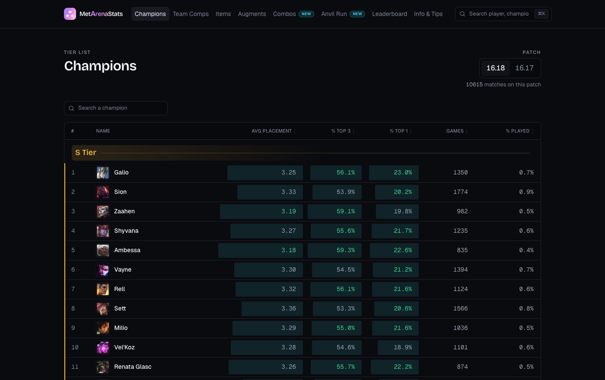

# MetArenaStats

Statistics for **League of Legends: Arena** — champion, item, augment and team-composition
tier lists, per-champion build pages, and a player ladder, all computed from matches
crawled continuously from the Riot API.

**Live: [metarenastats.tblabs.dev](https://metarenastats.tblabs.dev)**



Riot publishes no Arena leaderboard and no aggregate statistics for the mode. Everything
here is derived from raw match data: the site crawls matches, walks the player graph it
discovers, and recomputes every tier list once an hour.

Current scale: **~60 000 matches**, **1.08 M participations**, **217 000 players seen**,
**56 000 ranked**.

## How it works

```
Riot API ──> crawler ──> Postgres ──> hourly job ──> snapshots ──> ISR pages
             (GitHub      (Supabase)   (Vercel        (one JSON     (Next.js)
              Actions)                  function)      per view)
```

- **Crawler** — a GitHub Actions loop calls a cron route on the site, which fetches
  matches under Riot's rate limits and expands the player graph outwards from the players
  it already knows. A second pass pulls each match's timeline, which is the only source
  for *purchase order* (the match endpoint returns inventory slots, not the order items
  were bought in).
- **Hourly job** — one function reads the two published patches, recomputes every
  aggregate, refreshes the player ratings, and writes each result as a row in
  `stats_snapshots`.
- **Pages** — every page serves a precomputed snapshot and revalidates every 30 minutes,
  so no page load ever aggregates the database.

The whole job has to fit in a single 300-second serverless invocation, which is the
constraint that shapes most of the data layer: keyset pagination, a materialized view
restricted to the published patches, incremental resume for the rating syncs.

## The parts worth reading

Arena statistics are unusually easy to get wrong, because the obvious measurement is
almost always biased. Three examples, each documented in the code where it lives:

**Items inherit the placement of games that lasted** — [`src/lib/aggregate.ts`](src/lib/aggregate.ts).
A sixth item only exists in a game that went long enough to buy six items, so late items
look strong for reasons that have nothing to do with the item. Measured on the sample:
average placement goes from 3.90 at three items to 2.48 at six. Worse, late items are
bought by *better players* (correlation 0.556 between purchase slot and buyer rating), and
those players place better whatever they buy (−0.720). The fix is landmark analysis, the
standard correction for immortal-time bias in epidemiology: every acquisition is compared
only to other acquisitions at the same point in the build *and* the same player skill band.
Displayed columns stay raw — only the tier carries the correction, because a column
labelled "Avg Placement" must state what actually happened.

**Tiers** — [`src/lib/tiers.ts`](src/lib/tiers.ts). Metrics are shrunk toward the batch
mean in proportion to how little evidence backs them, combined 60 % average placement /
20 % top-1 / 20 % top-3, then grouped into bands by 1-D k-means rather than forced
quintiles, so a tier boundary lands on a real gap in the distribution instead of an
arbitrary 20 % cut. The shrinkage anchor has a floor: it used to self-calibrate to the
batch, which meant that on a single champion's augments — where every sample is small —
it stopped protecting anything, and two-game outliers reached the top five.

**Player ratings** — [`src/lib/rating.ts`](src/lib/rating.ts),
[`src/lib/playerRatings.ts`](src/lib/playerRatings.ts). Arena is eight teams of three with
a full ranking, not a duel, so Elo doesn't apply. This is a Weng-Lin / Plackett-Luce
rating computed in-house, replayed three times over the full history — a cheap
approximation of TrueSkill Through Time, which removes the bias of judging a player's
first games against opponents still sitting at the default rating. Measured on a held-out
15 % of matches, prediction accuracy for players with 10+ games goes from 56.7 % with one
pass to 60.2 % with three; the curve is flat after that.

[`supabase/schema.sql`](supabase/schema.sql) is the other file worth opening: every index
and every function carries the measurement that justified it.

## Stack

Next.js 16 (App Router, React 19, TypeScript, Tailwind v4) on Vercel · Postgres on
Supabase, reached through PostgREST · GitHub Actions for scheduling · no ORM, no state
manager, no component library.

## Running it locally

```bash
npm install
cp .env.example .env.local   # then fill in the values below
npm run dev
```

| Variable | Used for |
|---|---|
| `SUPABASE_URL`, `SUPABASE_SERVICE_ROLE_KEY` | database access (server-side only) |
| `RIOT_API_KEY` | crawling and player search |
| `CRON_SECRET` | authenticates the cron routes |

The schema lives in [`supabase/schema.sql`](supabase/schema.sql) and can be applied to a
fresh Supabase project as-is. Without a database the site builds and renders, but every
page is empty.

## Layout

```
src/app/        routes — tier lists, champion pages, player pages, cron endpoints
src/components/ shared UI (tiered tables and grids, tooltips, patch switch)
src/lib/        aggregation, tiers, ratings, Riot client, crawler, snapshots
supabase/       full schema: tables, views, indexes, SQL functions
docs/           architecture notes
scripts/        tooling (game data refresh, patch boundaries, screenshots, key check)
```

Code comments and commit messages are in French; the product and the public API are in
English.

---

Not endorsed by Riot Games. League of Legends and Riot Games are trademarks or registered
trademarks of Riot Games, Inc.
